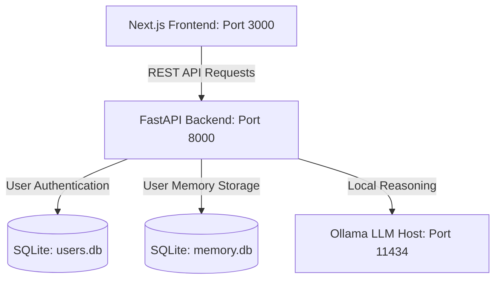

# 🤖 AgentFlow Workstation

AgentFlow is a local-first, multi-purpose AI assistant workspace powered by **Ollama**, **Next.js**, and **FastAPI**. It is designed to run completely on your local machine—ensuring zero data leakage, high privacy, and no API subscription costs.

---

## 🎨 Design & Layout (Karyam UI Scheme)
AgentFlow features a clean, minimalist developer-focused **Cool Slate & Royal Blue** layout (inspired by the Karyam aesthetic):
*   **Vertical Sidebar Layout**: Clean horizontal navigation routes positioned on the left for direct access.
*   **Vibrant Royal Blue Highlights**: Main buttons, selected tabs, and active route targets styled in `#2563EB`.
*   **Consistent Light & Dark Themes**: Transition smoothly between a cool-slate light workspace (`#F8FAFC`) and a midnight ice-navy developer workstation (`#090D16`).

---

## 🚀 Workflows & Features

### 💬 1. Conversational Chat Agent
*   **Memory-Aware**: Remembers user facts, rules, and preferences locally.
*   **Tool Execution**: Employs safe custom tools (Calculator, Local File Reader, Text Summarizer) before answering.
*   **Model Switcher**: Dynamic drop-down selection of active local LLMs (e.g., `llama3`, `phi3`, `qwen2.5`) directly from the sidebar.

### 📄 2. Document Intelligence (PDF, TXT, DOCX)
*   **Multi-format Extraction**: Parses and extracts text content from PDF, plain text, and Word `.docx` documents (including tabular layouts).
*   **Automatic Summarization**: Provides clean, bullet-point outlines.
*   **Document Q&A**: Let's you ask custom context-bound questions on document datasets.

### 📊 3. Data Analysis (CSV Profiler)
*   **Profile Generation**: Computes counts, column data types, missing value statistics, and descriptive metrics using `pandas`.
*   **Table Preview**: Interactive spreadsheets displaying the first few rows of uploaded data.
*   **AI Data Insights**: Query database trends directly using local reasoning models.

### 📄 4. Resume Optimizer (ATS Optimizer)
*   **ATS Scoring**: Analyzes resumes against custom job descriptions to output score match percentages.
*   **Keyword Matches & Skill Gaps**: Details missing competencies and suggests industry keywords.
*   **Bullet Point Rewriter**: Suggests before-and-after experience bullet improvements using metrics and action verbs.
*   **Concise Summaries**: Focuses generation on updated sections only, reducing processing times.

### 🔗 5. LinkedIn Generator
*   **Engaging Narratives**: Turn achievements, papers, or career highlights into structured posts (Hook, Body, Impact statement, Hashtags).
*   **Tone Selection**: Customize posts (e.g. professional, developer, casual).

---

## 📐 System Architecture



*   **Frontend**: Next.js 16 (Turbopack) using Tailwind CSS v4 running on `http://localhost:3000`.
*   **Backend**: Python FastAPI web server running on `http://localhost:8000`.
*   **Local LLM Engine**: Ollama server listening on `http://localhost:11434`.

---

## 📦 Getting Started & Setup

### Prerequisites
1.  Download and install **[Ollama](https://ollama.com/)**.
2.  Pull local models via your terminal:
    ```bash
    ollama pull qwen2.5:1.5b    # Fast, light, loads instantly
    ollama pull phi3:latest     # Medium-weight
    ollama pull llama3:latest   # Heavy, advanced reasoning
    ```

### 1. Launch Backend Server
Navigate to the `backend` folder, set up your Python path, and start Uvicorn:
```bash
cd backend
# Windows PowerShell
$env:PYTHONPATH="D:\Lib\site-packages;."
python -m uvicorn main:app --port 8000 --host 0.0.0.0 --reload
```

### 2. Launch Frontend Dev Server
Navigate to the `frontend` folder and start the Next.js development workstation:
```bash
cd frontend
npm install
npm run dev
```
Open **[http://localhost:3000](http://localhost:3000)** in your browser!

---

## 🛡️ Security & Privacy
Because AgentFlow runs entirely locally:
*   Your documents, chats, and resumes **never** leave your machine.
*   User passwords are encrypted using SQLite and `hashlib` SHA-256.
*   A root-level `.gitignore` blocks raw databases (`users.db`, `memory.db`), document cache folders (`uploads/`), and development outputs (`.next/`, `node_modules/`) from being pushed online.
